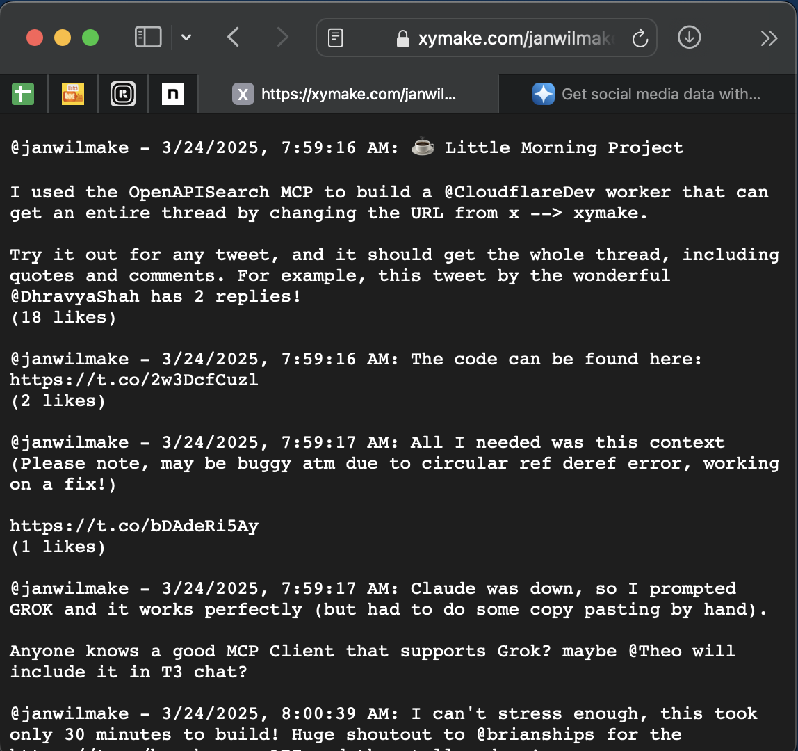
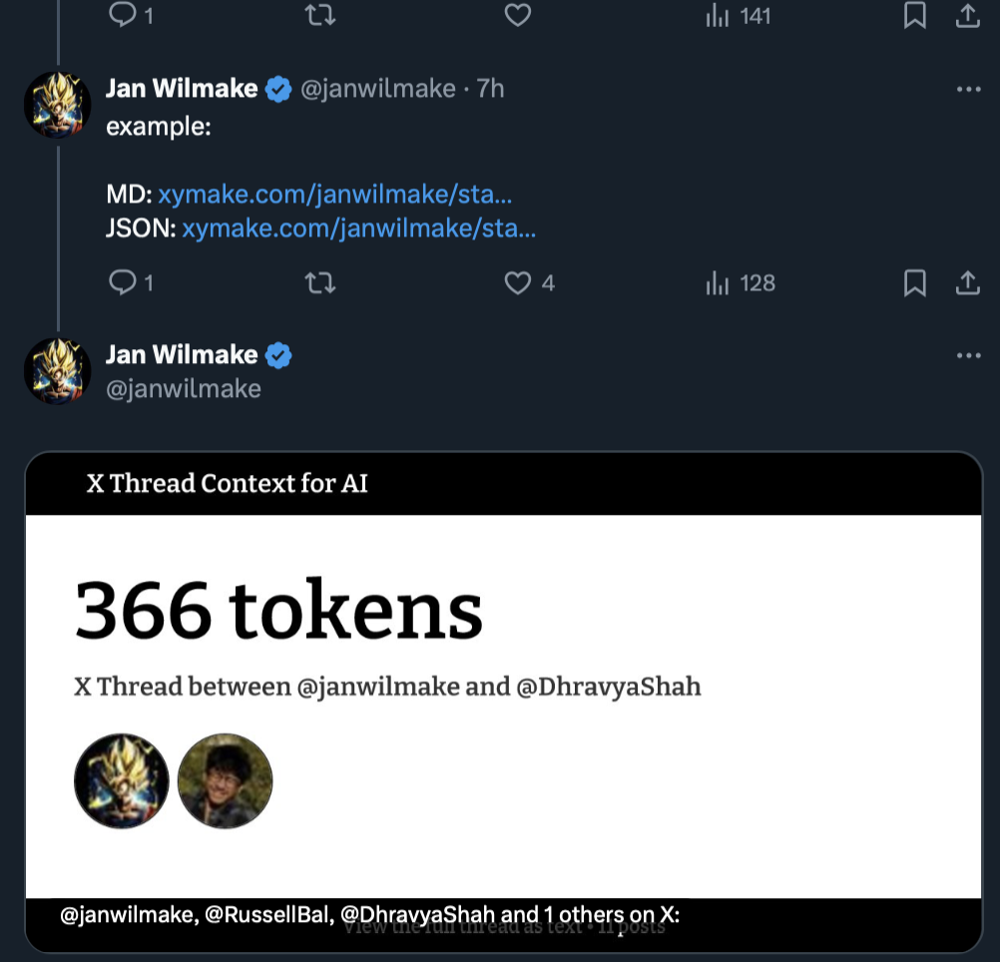

# 🔧 XYMake - Turn Your 𝕏 Into LLM-Ready Data

Login at https://xymake.com to Free Your X Data and use it with any LLM, MCP, or API.

Goals:

- provide an easy way to interact with X context programatically (using APIs and MCP) in different formats
- focus lies on creating full-context conversations in plain text
- provide an easy way for devs to build with X actions such as posting
- strong focus on UX that enables high adoption

Out of scope:

- Build products on top of this (AI personas, SEO tools, Content repurposing, data intelligence, etc)

Unanswered Questions:

- How do people think about their data? owning it privatly is one step, is making it fully public desired or do we need more control?
- Is the onboarding flow clear? is choosing the use-case helping or does it only confuse people?
- Which products are out there today that can be connected with the X context to provide value (tools such as the ones mentioned in 'out of scope')?

# CHANGELOG

## Half an hour turned into 10 hours - I made this POC in a day! (2025-03-24)

As I made [https://openapisearch.com](https://openapisearch.com) friday and saturday, this morning I woke up with an idea to quickly try out [https://openapisearch.com/socialdata.tools](https://openapisearch.com/socialdata.tools) because it would allow me to improve my POC of pulling LLM context from my X threads. To my surprise, after about 30 minutes I actually [got it working](https://x.com/janwilmake/status/1904080559422288062)!

I really wanted to work on some low-hanging fruit for [https://openapisearch.com](https://openapisearch.com) today as there is quite a lot, but I just couldn't resist the urge to do a few improvements to XYMake first. And now it's 5PM... I spent the whole day on something unplanned. As a result, I've been in flow all day. And I don't think it's a waste of time.

The following is what I spent my entire day on:

- ✅ Initial implementation (see https://x.com/janwilmake/status/1904080559422288062)
- ✅ Calculate data to serve in the og:image and thread
- ✅ Respond with HTML but only for crawlers. This HTML is also SEO optimised.
- ✅ OG Image for any thread, counting tokens and including usernames and images of the participant(s).
- ✅ Change landingpage to show opportunity of unlocking your data.
- ✅ Tweak og:image further so it renders everywhere perfectly.
- ✅ Ensure you can only see the markdown if the main contributor of the conversation has freed their data!

The result is what you can see at https://xymake.com. Change any X URL into xymake.com and you get flat text out for the entire thread + comments.

For example: https://x.com/janwilmake/status/1904080559422288062

Becomes [this markdown thread](https://xymake.com/janwilmake/status/1904080559422288062):



The key thing I focused on is smooth onboarding. XYMake features:

- OAuth2 onboarding (built from scratch using Cloudflare Worker Primitives)
- OG Image generation for each thread for easy sharing of threads. See below:



There are some neat little tricks in this codebase that I aim to explain here...

So how did I do this?

**serving different things to different type of consumers**

In this project I used the following function to determine whether a request comes from a crawler, a user, or an agent:

```ts
const getCrawler = (userAgent: string | null) => {
  const crawlers = [
    { name: "Facebook", userAgentRegex: /facebookexternalhit|Facebot/ },
    { name: "Twitter", userAgentRegex: /Twitterbot/ },
    { name: "LinkedIn", userAgentRegex: /LinkedInBot/ },
    { name: "Slack", userAgentRegex: /Slackbot-LinkExpanding/ },
    { name: "Discord", userAgentRegex: /Discordbot/ },
    { name: "WhatsApp", userAgentRegex: /WhatsApp/ },
    { name: "Telegram", userAgentRegex: /TelegramBot/ },
    { name: "Pinterest", userAgentRegex: /Pinterest/ },
    { name: "Google", userAgentRegex: /Googlebot/ },
    { name: "Bing", userAgentRegex: /bingbot/ },
  ];
  const crawler = crawlers.find((item) =>
    item.userAgentRegex.test(userAgent || ""),
  )?.name;

  return crawler;
};

/** Useful function to determine what to respond with */
export const identify = (
  request: Request,
): {
  /** Based on the user-agent, we think the the user is a crawler (such as Google) */
  isCrawler: boolean;
  /** The request does not want text/html */
  isAgent: boolean;
  isBrowser: boolean;
  preferHTML: boolean;
} => {
  const acceptHeader = request.headers.get("Accept");
  const crawler = getCrawler(request.headers.get("user-agent"));
  const isCrawler = !!crawler;
  const isBrowser = !!acceptHeader?.includes("text/html");
  const isAgent = !isBrowser;
  const preferHTML = isBrowser || isCrawler;

  return { isCrawler, isAgent, isBrowser, preferHTML };
};
```

With this trick, I was able to serve the html with og-image to crawlers, while serving agents and humans raw markdown on the very same URL. This is a trick I've also applied at https://uithub.com and many other websites.

Besides this, we need to make sure the og:image is ready, and as fast as possible, once the user shares the image on social media. I did this using the `ctx.waitUntil` primitive to actually preload the og:image generation, and then cache it, before the crawler goes there. Because the user hopefully already visited the link they shared, the crawler should get an image nearly instantly, because it's cached.

`getThread.ts:178`

```ts
// NB: This is only to pre-generate the og image so it's available quicker the second time
ctx.waitUntil(
  getOgImage(
    new Request(request.url.replace("/status/", "/og/")),
    env,
    ctx,
    true,
  ),
);
```

Last but not least, the `og:image` serving to different platforms is quite tricky. I've used the wonderful package [`workers-og`](https://github.com/kvnang/workers-og) to turn a piece of specialized HTML into an SVG and then into a PNG, all from a [Cloudflare Worker](https://workers.cloudflare.com). Also, I've previously built https://quickog.com to easily generate the right code to be used in vanilla HTML, and reused that here. As a result, the og:image shows up quite fast when going to any status URL.

That's about it! Now I've built an entire product in a long day of flowstate. I'm exhausted and excited. Time for some food. You may wonder if I used any AI? Of course! There's no such thing as this without AI. I don't use Cursor (yet), but I've used a combination of Claude Anthropic and Grok today for my code generation from natural language specification. Of course this would be impossible without. The project now contains ±40.000 tokens of code, but the amount of instructions I gave in natural language is probably well below that.

**So what's my vision for XYMake?**

I don't know about much about the legal aspect of it, and I'm sure it's gray area, but I strongly that people should have the right to own their own data. Elon advocates for Freedom of Speech, and I surely hope he'd also agree with the right to 'own your own data that is an outcome of freedom of speech'. X obviously uses our posts now to train Grok, and we, the people, should claim our right to our own conversations too. We can probably do much more cool things with it than just train Grok!

That said, I also feel some could be uncomfortable with sharing all their data into the intelligent world wide web. Maybe people don't want this at all and feel like X is a platform where their data is kept behind bars(Safely with Elon, Grok, and [@yacineMTB](https://x.com/yacineMTB)). That's why I decided for now to only allow accessing Markdown posts of users that "Freed their Data". Users that haven't enabled it, won't be exposed here, unless they're not the major contributor of a thread. But if the major contributor to any thread has unlocked their X data with XYMake, the entire public conversation is now public to the WWW.

**Before I launched**

I tested the product with an actual test-user just 1 minute before I wanted to launch (the advantage of working from a coworking space is that you can do this wihtin a minute). I found two very critical failure points in my UX, and solved them:

1. People would go to https://xymake.com/{username} and would think they were done already, however, they needed a 400 page
2. All posts where always scraped but not shown. This has been fixed too now. Phew!

I'm excited to [share this on X now](https://x.com/janwilmake/status/1904234442937536644), and see what you guys have to say! I feel we can use our own posts for so much more than just within Grok, and this is just the first step to make anything possible!

## Collecting feedback and iterate (2025-03-25,26,27,28)

- ✅ Made the og:image show up for unauthorized threads as well, improved 400 page A TON. This could be GREAT marketing: https://x.com/AnandButani/status/1904476317283738105
- ✅ Made some improvements to the 400 page (data not free yet) - see https://x.com/janwilmake/status/1905268970220900549
- ✅ Now that it's easy to export, make a habit of writing my ideas as X threads.
- ✅ Biggest Bug: quoted posts shouldn't count towards 'main creator': https://xymake.com/amasad/status/1905261929452519838
- ✅ Get the actual URLs of media and links. EASY ONE
- ✅ Made an endpoint to get posts not commented on myself at any given day; endpoint /posts/{username}/{date}
- 🟠 See how the launch goes, collect feedback, and iterate!

## Improved auth (2025-03-29)

- ✅ Fix DO token-refresh and `getSubscriber`
- ❌ Add `priceCredit` to `getSubscriber` and keep track of balance.
- Make redirect url in xymake configurable (securely)
- If possible, fix `localhost:3000` auth as well. If not through X, use API
- Fix oauth flow for https://cli.forgithub.com both from landing and CLI
- also smooth if already logged in.

Now I can actually fix CLI. Great if fixed today and I can put 17 tweets out from terminal per day smoothly.

## Fundamentals

- ✅ Make the new router the core of xymake (using getFormat, allowing .ext convention)
- Attach oauth an a way such that it's freemium (ip-ratelimit) and keeps usage and balance of the user (sponsorflare style, but with X)
- See which endpoints can be easily done with https://socialdata.tools

## Make it cheaper for unauthorized profiles

- Scraping https://xymake.com/bryan_johnson/status/1904328460019077452 is too expensive.
- Make and keep a `free:{status}` in kv
- Instead, get main speaker tokens + number of comments + estimated tokens for total tokens.

For now the biggest priority is entire archive for your own threads

But then also lists, bookmarks, and likes.

# BACKLOG

- Fix DO for data aggregation: Make it easier to debug what happens in the alarms with a special log function, then make the explorer able to easily switch between available DO names (use CF api)

# Ideas

- [@brianships](https://x.com/brianships) - MCP
- [@nikitavoloboev](https://x.com/nikitavoloboev) wants realtime export of bookmarks and [likes](https://github.com/d60/twikit/issues/3)
- [@0xperp](https://x.com/0xperp) - list members of lists you created should be easy to export (e.g. https://x.com/i/lists/1784659545656021044)
- [@russelbal](https://x.com/RussellBal/status/1905723735908446221) - xy cli to X but add ability to POST it to standardized list of servers. cache busting with query string, for a complete regeneration.
- [@ThomasSlabbers](https://x.com/Thomasslabbers)

# Community work / opportunities

- https://uithub.com/helloprkr/xymake-plus - Turn Your 𝕏 Into LLM-Ready Data: Threads, Bookmarks, Media & More
- [@DefenderOfBasic](https://x.com/DefenderOfBasic) - Hierarchical file-structure data format (non-flat) - this is too different from this usecase. focus lies on full-context conversations.

# X URL Structure

XYMake aims to follow the url structure of X with sensible extensions to it, such as allowing to choose the data format (.md, .json, .html, etc). This way, things are always easy to find, just change x.com/... into xymake.com/... and you can see!

- **Profile Pages**:

  - ✅ `x.com/[username]/status/[tweet_id]` - Direct link to a specific tweet and its replies
  - `x.com/[username]` - should have links to all available data, and user profile details
  - `x.com/[username]/photo` the large png, served
  - `x.com/[username]/with_replies`
  - `x.com/[username]/highlights`
  - `x.com/[username]/articles`
  - `x.com/[username]/media` - Quick access to a user's photos and videos
  - `x.com/[username]/likes`
  - `x.com/[username]/following`
  - `x.com/[username]/followers`
  - `x.com/[username]/verified_followers`
  - `x.com/[username]/creator-subscriptions/subscriptions`
  - `x.com/[username]/lists`
  - (custom) `x.com/[username]/posts` - should have the posts
  - (custom) `x.com/[username]/reply/id/message`
  - (custom) `x.com/[username]/quote/id/message`
  - (custom) `x.com/[username]/new/message`
  - (custom) `x.com/[username]/bookmarks`

- Bookmarks: `x.com/i/bookmarks` - Saved tweets
- Specific list: `x.com/i/lists/[list_id]`
- List members: `x.com/i/lists/[list_id]/members`

- ❌ **Topics**: `x.com/i/topics`

  - Browse and follow topics

- ❌ **Communities**: `x.com/i/communities`

  - Twitter's group-like feature

- ❌ **Notifications**: `x.com/notifications`

  - Shows interactions with your account (likes, retweets, mentions)

- ❌ **Messages**: `x.com/messages`

  - Access to your direct messages

- ❌ **Home Timeline**: `x.com/home`

  - Main feed showing tweets from accounts you follow

- ❌ **Explore**: `x.com/explore`

  - Search and trending content

- ❌ **Search**: `x.com/search?q=[search_terms]`

  - Search results for specific queries

- ❌ **Spaces**: `x.com/i/spaces`

  - Live audio conversations
